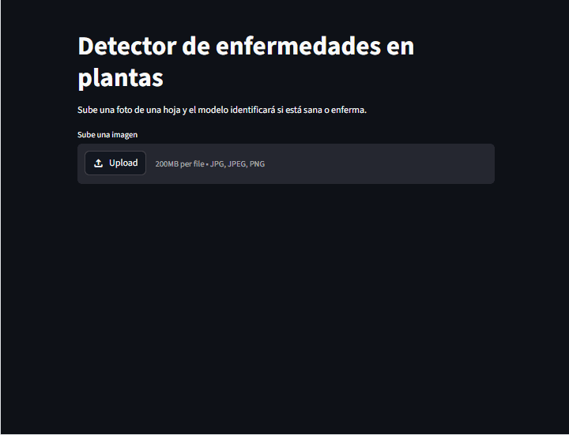

# Plant Disease Classifier

Modelo de deep learning capaz de detectar **38 enfermedades en plantas** a partir de una foto de hoja, con un 96.83% de accuracy en test.

## Demo

> Sube una foto de hoja y el modelo identifica la enfermedad en segundos.



## Resultados

| Métrica | Valor |
|---|---|
| Accuracy en validación | 97.16% |
| Accuracy en test | 96.83% |
| Clases | 38 |
| Imágenes de entrenamiento | 43,444 |

## Tecnologías

- **PyTorch** — entrenamiento del modelo
- **EfficientNet-B0** — arquitectura preentrenada en ImageNet
- **Transfer learning** — fine-tuning de la última capa
- **Streamlit** — interfaz web para probar el modelo
- **scikit-learn** — métricas de evaluación

## Cómo ejecutarlo localmente

```bash
git clone https://github.com/mrlocky97/plant-disease-classifier.git
cd plant-disease-classifier
pip install -r requirements.txt
streamlit run app.py
```

## Dataset

[PlantVillage Dataset](https://www.kaggle.com/datasets/abdallahalidev/plantvillage-dataset) — 54,305 imágenes de hojas de 14 especies de plantas.

## Estructura del proyecto
plant-disease-classifier/
├── 01_exploracion_datos.ipynb
├── 02_entrenamiento.ipynb
├── 03_evaluacion.ipynb
├── app.py
├── mejor_modelo.pth
├── requirements.txt
└── README.md